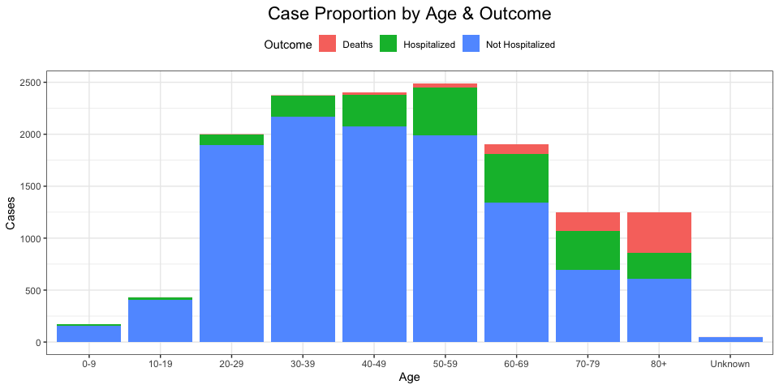
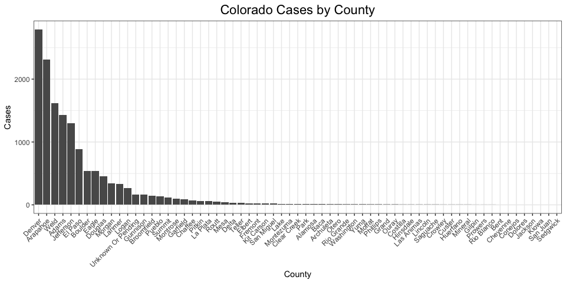
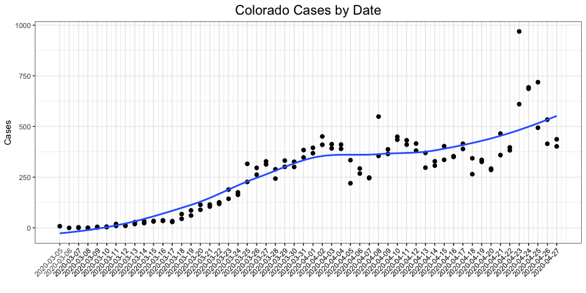

<!-- README.md is generated from README.Rmd. Please edit that file -->

# Outbreak Summary

### April 06, 2020


### [stufield.github.io/COVID-19](https://stufield.github.io/COVID-19)

# COVID-19 Pandemic - Colorado

This page highlights the `COVID-19` cases in Colorado both through time
and by county (CO has 64 counties).

Data is obtained from the Colorado Department of Public Health &
Environment (CDPHE).

See the `CDPHE` [website](https://covid19.colorado.gov/case-data) for
more information and raw case data.

-----

## Cases by Sex

| Sex     | Percent |
| :------ | :------ |
| Female  | 51.85%  |
| Male    | 47.60%  |
| Unknown | 0.55%   |

## Cases by Age

``` r
data %>%
  dplyr::filter(
    description == "Case Counts by Age Group, Hospitalizations, and Deaths" &
      attribute != "Note") %>%
  tidyr::separate(attribute, into = c("Age", "Outcome"), sep = ", ") %>%
  dplyr::select(Age, Outcome, Cases = value) %>%
  ggplot(aes(x = Age, y = Cases, group = Outcome)) +
  geom_bar(stat = "identity", aes(fill = Outcome)) +
  ggtitle("Case Proportion by Age & Outcome")
```

<!-- -->

## COVID-19 Cases by County

``` r
county_data %>%
  ggplot(aes(y = value, x = reorder(County, -value))) +
  geom_bar(stat = "identity") +
  theme(axis.text.x = element_text(angle = 45, hjust = 1)) +
  labs(y = "Cases", title = "Colorado Cases by County", x = "County")
```

<!-- -->

## COVID-19 Cases Over Time

``` r
time_data %>%
  ggplot(aes(x = date, y = value)) +
  geom_point(size = 2) +
  geom_smooth(method = "loess", se = FALSE) +
  scale_x_date(breaks = time_data$date) +
  theme(axis.text.x = element_text(angle = 45, hjust = 1)) +
  labs(y = "Cases", title = "Colorado Cases by Date", x = "")
```

<!-- -->

-----

Created by [Rmarkdown](https://github.com/rstudio/rmarkdown) (v2.1) and
R version 3.6.3 (2020-02-29).
